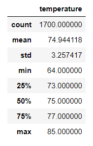
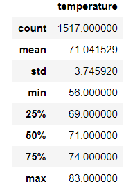

# surfs_up
## Overview of the Statistical Analysis
W. Avy is looking at opening a shop in Hawaii and has tasked us with performing a statistical analysis using SQLlite to understand the viability of this project. W. Avy is thinking about having a surf and ice cream shop and thinks that looking at the months of December and June are a good starting point. He wants to use this weather data to help inform investors about his idea. 
## Results

- The average temperature in June is 74.9 degrees with a standard deviation of 3.26
- The minimum Temperature is 64 degree and the maximum is 85 degrees.
- We have 1700 data points to look at so this is a robust dataset.

- The average temperature in June is 71 degrees with a standard deviation of 3.74
- The minimum Temperature is 56 degree and the maximum is 83 degrees.
- We have 1517 data points to look at so this is a robust dataset.
## Summary
While the temperatures in both June and December are not drastically different, there is more variability in the December data. As most would expect, December is slightly colder. We do not believe that December being colder would signifcantly affect the viability of the shop. If we were to perform additional queries on this project, I would reccomend doing a deep analysis of the amount of precipiation each month gets and throughout the entire year. I would also reccomend looking at the amount of days that are sunny versus cloudy.
